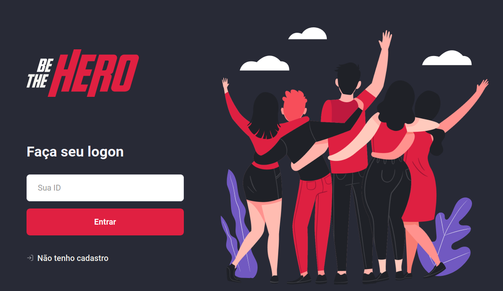
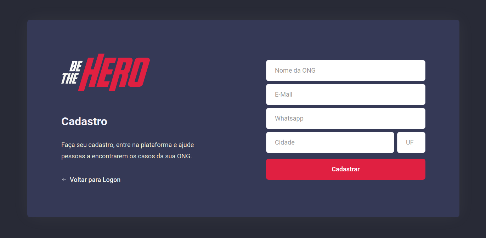
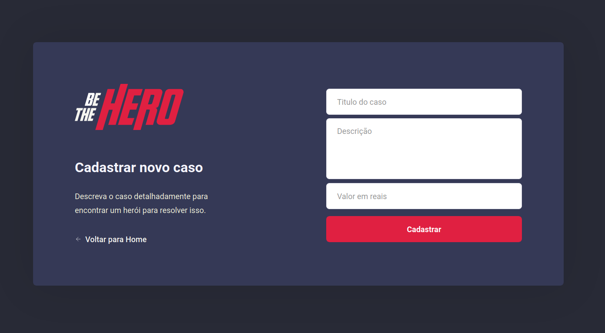
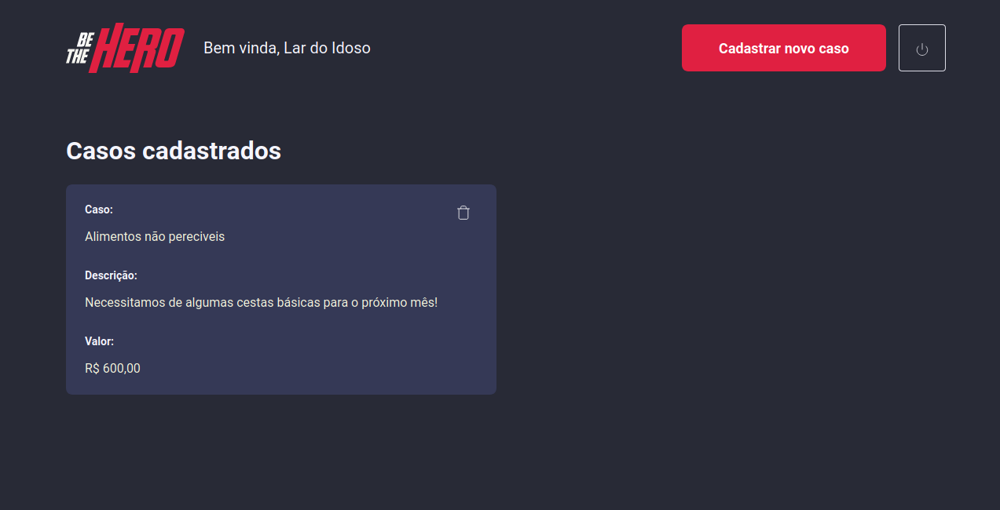

## 

# Projeto desenvolvido na Semana Omnistack 11 com algumas modificações:

> O intuito dessa app é unir pessoas que sentem vontade e tem disponibilidade (seja com mão de obra ou financeiramente) com ONGs, instituições sem fins lucrativos que precisam de ajuda com casos específicos.

---

## Aqui você pode cadastrar ONGs:

---

## Aqui a ONG logada cadastra novos casos:

---

## Aqui a ONG logada visualiza os casos:

---

### Techs utilizadas:

- NodeJS
  - Cors
  - Express
  - Knex
  - Sqlite
  - Nodemon
  - Sucrase
- ReactJS
  - React Router Dom
  - React Toastify
  - Styled Components
  - Styled Icons
  - Polished
  - Axios
