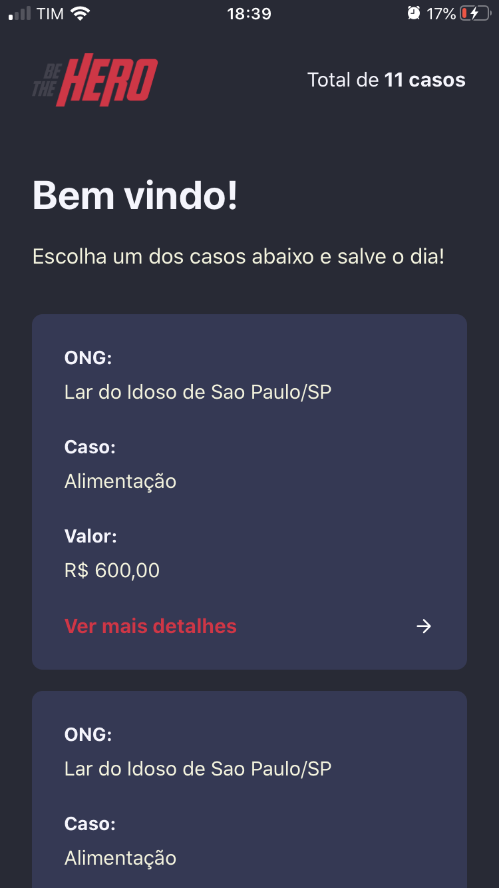
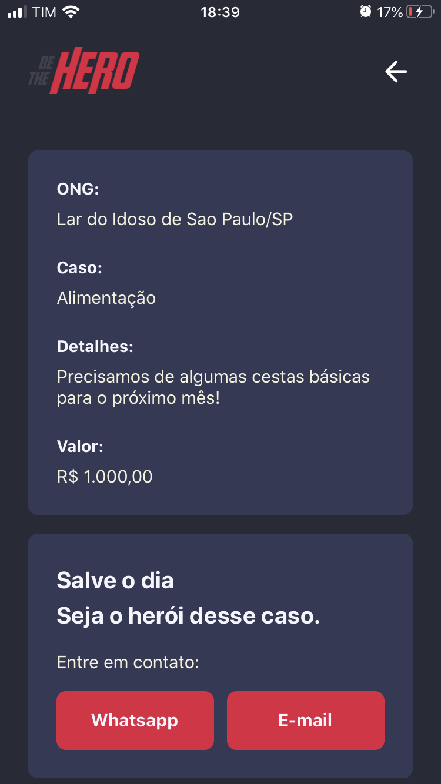
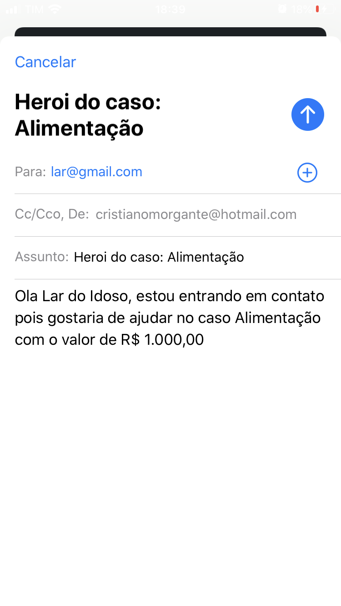

## 

# Projeto desenvolvido na Semana Omnistack 11 com algumas modificações:

> ## O intuito dessa app é unir pessoas que sentem vontade e tem disponibilidade em ajudar (seja com mão de obra ou financeiramente) com ONGs, instituições sem fins lucrativos que precisam de ajuda com casos específicos.

## Versão Web

> ### Aqui você pode cadastrar ONGs:

---

> ### Aqui a ONG logada cadastra novos casos:

---

> ### Aqui a ONG logada visualiza os casos:

> Apresentação em vídeo:

---

## Versão Mobile

> ### Tela Home

---

> ### Tela Detalhes

---

> ### Tela de envio de email

---

> Apresentação em vídeo:

---

### Techs utilizadas:

- NodeJS
  - Cors
  - Celebrate
  - Cross-Env
  - Express
  - Knex
  - Sqlite
  - Nodemon
  - Sucrase
  - Supertest
  - Jest
- ReactJS
  - React Router Dom
  - React Toastify
  - Styled Components
  - Styled Icons
  - Polished
  - Axios
- React Native
  - Axios
  - Expo
    - expo-constants
    - expo-mail-composer
  - React Navigation
    - @react-navigation/native
    - @react-navigation/stack
  - Intl
